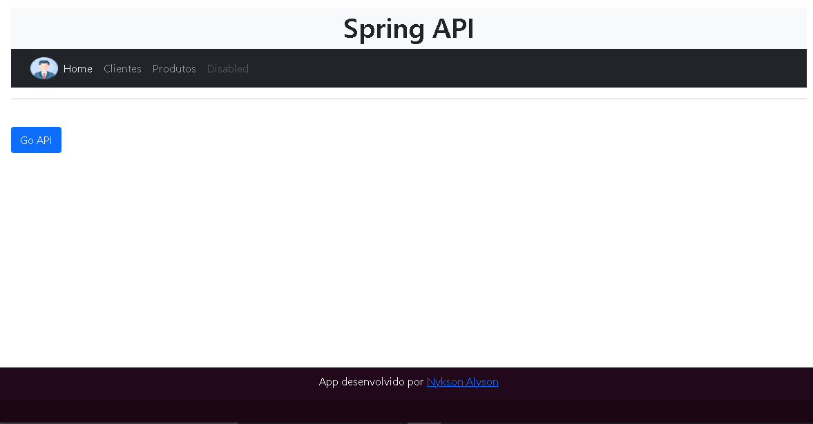
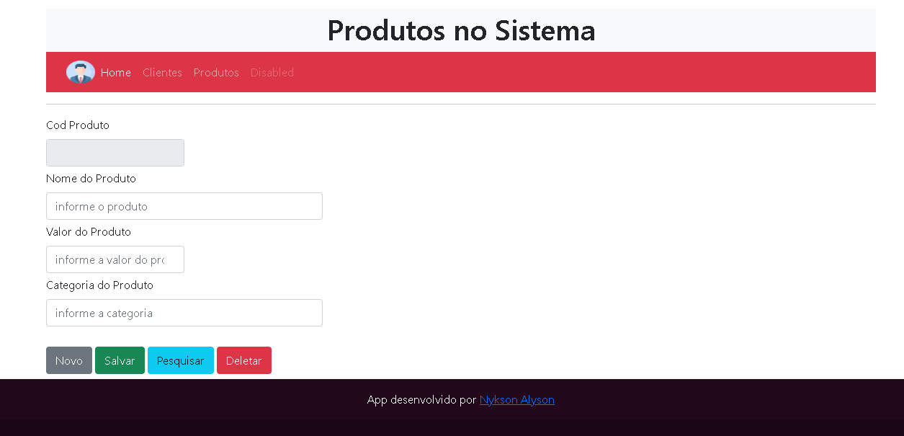

# CRUD Web Completo com Spring Boot REST API com JAVA, PostgreSql, Javascrip, Html, BootStrap 5.0
# Link da aplicação: https://crud-spring-web.herokuapp.com/

<h3>Tela Home</h3>

 
  <h3>Tela Cadastro Usuarios</h3>

 
  <h3>Tela Cadastro Produtos</h3>

